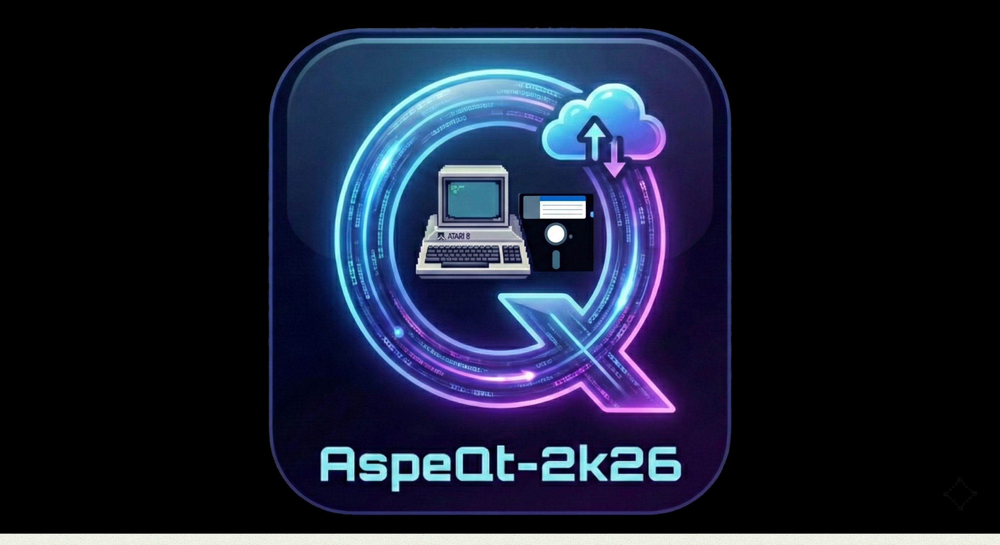

# Atari AspeQt-2K26



### The Modern Atari 8-bit Serial Peripheral Emulator
**Built for 2026 and beyond | Powered by Qt 6**

---

### Project Overview
AspeQt-2K26 is a modernized fork of the classic AspeQT/RespeQt emulator. It emulates Atari SIO peripherals (Disk Drives, Printers, etc.) when connected to an Atari 8-bit computer (400/800/XL/XE) via an SIO2PC cable.

This version migrates the codebase to **Qt 6**, fixing critical stability issues and introducing high-performance networking and hardware-level emulation for modern operating systems.

> **⚠️ CRITICAL WINDOWS SETTINGS (Windows ONLY):** If you are using Windows with an FTDI-based USB-to-Serial adapter, you must adjust the advanced COM port settings in the Windows Device Manager to ensure stable SIO timing and prevent checksum errors. You must set the **Latency Timer to 1 msec** (the Windows FTDI default of 16ms will cause severe SIO timeouts) and reduce the **USB Transfer Sizes (both Receive and Transmit) to 256 bytes**. Do not skip this step on Windows!

### ✨ What's New in AspeQt-2K26

#### 1. Full Qt 6 Native Port
* **Modern Framework:** Fully ported to the Qt 6 framework for enhanced stability and long-term support.
* **High-DPI Support:** Optimized UI for modern monitors and 4K displays.

#### 2. Client TNFS Support
* **Cloud Storage:** Direct support for mounting disk images from TNFS servers (like `13leader.net`) without needing local files.
* **Dynamic Browsing:** Integrated TNFS browser with thread-safe download progress tracking.

#### 3. Native W: and Y: Drivers
* **W: (Network Device):** A native SIO implementation of the Network Streaming Device. Supports HTTP and FTP (via system `curl`) for downloading data directly to the Atari. Includes EOL translation between Unix (LF) and ATASCII (EOL).
* **Y: (Clipboard Device):** Bridges the Atari to your modern OS clipboard. Use `OPEN #1,4,0,"Y:"` to read the PC clipboard or `OPEN #1,8,0,"Y:"` to write to it.

#### 4. Legacy Modem Bridge (RS232 to TCP)
* **Hayes Emulation:** Bridges a secondary PC serial port to the Internet, allowing you to use a physical Atari 850 Interface, P:R: Connection, or R-Verter to access modern BBSes.
* **BBS Phonebook:** Integrated XML phonebook support for quick dialing.
* **Macros & Automation:** Built-in Macro support (Auto-User/Auto-Pass) to speed up BBS logins using `ESC-U` and `ESC-P`.

#### 5. Native 850 R: Device Emulation (Virtual Modem)
* **Hardware-Free Telecommunications:** A kernel-bypass, SIO-level emulation of the **Atari 850 Interface Module**. It intercepts SIO Poll (`$40`) and Stream (`$58`) commands, allowing the Atari to connect directly to Telnet and SSH hosts without physical RS-232 hardware.
* **Smart Protocols:** Features native SSH authentication (Linux boxes) and raw Telnet parsing (Retro BBSes), mapping standard AT commands directly to TCP/IP sockets.
* **Dynamic Baud Rates:** Automatically handles the Atari's 19200 baud SIO initialization and dynamically down-shifts to 9600 baud for concurrent stream mode (highly recommended for Ice-T and BobTerm).
* **🔌 HARDWARE COMPATIBILITY:** This feature fully supports both **standard USB SIO2PC adapters** (FTDI) and direct **Raspberry Pi raw UART** connections.
* **FT-232 / USB Adapter Note:** If using a USB adapter, ensure it has the `CTS` pin connected to the Atari's `COMMAND` line. Depending on how your specific FTDI chip was configured at the factory, you may need to toggle the "Invert CTS Logic" setting in AspeQt's options for it to communicate properly.
* **Documentation:** Please refer to the [Hardware Documentation](doc/) for USB SIO2PC wiring, CTS configuration, and Raspberry Pi SIO-to-GPIO setup.

#### 6. Interactive Web Dashboard (Remote UI)
* **Mobile-Friendly Control:** A fully responsive HTML5 web interface that allows you to control the emulator remotely from your smartphone, tablet, or another PC on your local network.
* **Bidirectional WebSocket Bridge:** Features real-time, asynchronous synchronization between the Qt Desktop UI and the Web Dashboard. 
* **Full Remote SIO Management:** Mount disk images, eject, toggle write-protection, create blank floppy images, and enable "Happy Mode" directly from your phone.
* **Network Streaming & Cassettes:** Mount TNFS streams headlessly or control the virtual cassette deck (Play/Rewind/Eject) seamlessly over the air.
* **Remote Diagnostics & BBS:** Access the live System Log, view the ASCII Printer Spooler, and dial BBSes using the one-tap XML Phonebook auto-dialer without ever touching the host PC.

---

### 💾 Atari Drivers & Software
The required Atari-side drivers to utilize the `R:`, `Y:`, and `W:` devices are included directly in this repository.
* **Ready-to-Use Disk Image:** You can find the compiled drivers on the `mydos drivers.atr` disk image located in the [`/atari` folder](https://github.com/pjones1063/AspeQt-2k26/tree/main/atari). Mount this to D1: to easily load the handlers into your Atari's memory.
* **Source Code:** The original 6502 assembly source code for these drivers is also available in the same folder under the `8-bit` directory for anyone who wants to modify or study them.

---

### ⌚ Time Synchronization (Real-Time Clock)
AspeQt-2k26 features built-in support for the **ApeTime** protocol, allowing your Atari to synchronize its clock with your PC automatically.

* **Recommended Method:** Use a standard ApeTime-compatible driver like `ATIME.SYS` on SpartaDOS X.
* **Legacy Support:** The `aspecl` client is included for backward compatibility with older setups.

---

### Support & Community
Support and inquiries can be made on our BBS or via our GitHub issues page. We love talking Atari!
* **Telnet:** `telnet 13leader.net 8023`
* **Web:** [http://13leader.net](http://13leader.net)

---

### Building from Source

**Core Requirements:**
* CMake 3.16+
* Qt 6.x Development Libraries
* C++17 Compiler
* `libssh` (Required for encrypted TNFS client connections)
* `libgpiod` (Linux/Raspberry Pi only - Required for hardware SIO interrupts)

#### Debian / Ubuntu / Raspberry Pi OS (Bookworm)
To install all necessary build tools and dependencies in one shot, run the following command in your terminal:
```bash
sudo apt update
sudo apt install build-essential cmake git unzip ca-certificates \
qt6-base-dev qt6-serialport-dev qt6-websockets-dev \
qt6-webchannel-dev qt6-httpserver-dev qt6-tools-dev qt6-l10n-tools \
libssh-dev libgpiod-dev

mkdir build
cd build
cmake -DCMAKE_BUILD_TYPE=Release ..
cmake --build . --parallel

